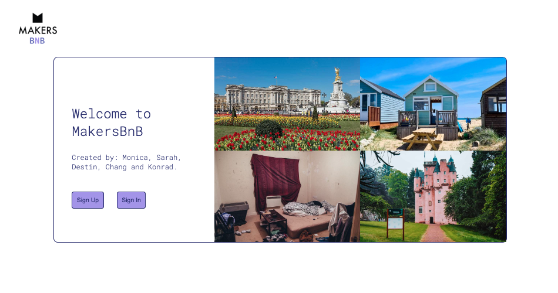

# MakersBnB Project

This was our first team project on the Makers Academy course.

An Airbnb clone that allows users to list and rent spaces.

Created by: Konrad, Sarah, Monica, Chang & Destin




## Setup

```bash
# Install gems
bundle install

# Run the tests
rspec

# Run the server (better to do this in a separate terminal).
rackup
```